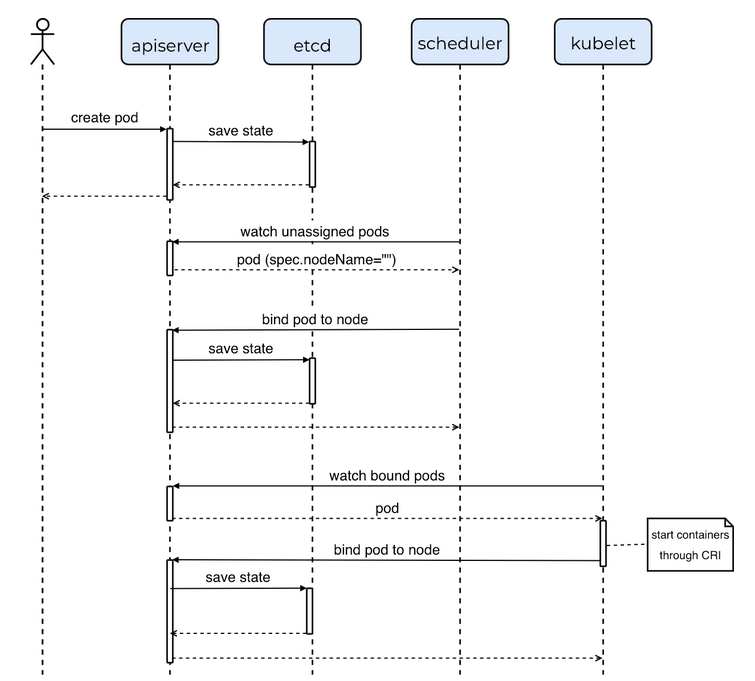
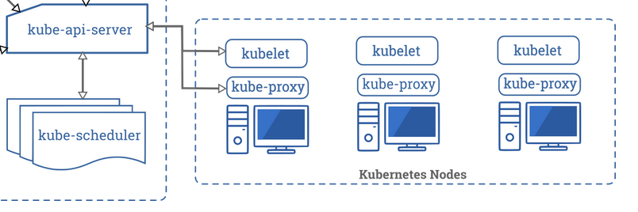
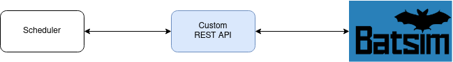
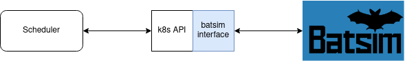
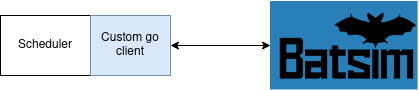
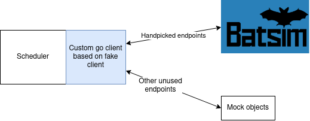

# Batsim / Kubernetes interface

## State of the art

### Simulation

#### k8s-cluster-simulator

* [github](https://github.com/pfnet-research/k8s-cluster-simulator)
* [website](https://tech.preferred.jp/en/blog/k8s-cluster-simulator-release/)

##### Simulating a workload

```go
// Pod represents a simulated pod.
type Pod struct {
	v1      *v1.Pod
	spec    spec
	boundAt clock.Clock
	status  Status
	node    string
}
```

```go
// spec represents a list of a pod's resource usage spec of each execution phase.
type spec []specPhase

// specPhase represents a pod's resource usage spec of one execution phase.
type specPhase struct {
	seconds       int32
	resourceUsage v1.ResourceList
}
```

A pod workflow is split in phases called `specPhase`. In each of these phases,
the pod will use the resources specified in resourceUsage during a
predetermined amount of seconds.

A pod duration is then the sum of all specPhase durations. Phases durations and
resourceUsage are determined in some yaml file.

```go
// parseSpecYAML parses the YAML into spec.
// Returns error if failed to parse.
func parseSpecYAML(specYAML string) (spec, error) {
	type specPhaseYAML struct {
		Seconds       int32                      `yaml:"seconds"`
		ResourceUsage map[v1.ResourceName]string `yaml:"resourceUsage"`
	}
```

#### JoySim simulator by <span>JD.com</span>

* [link to the pdf](https://static.sched.com/hosted_files/kccncna19/97/KubeCon_JoySim.pdf)

Very complete simulator with metrics by <span>JD.com</span> to test new
configurations or schedulers.

> Planning to work with CNCF SIG-Scheduling for an open source release.

#### Mocking Kubernetes

##### Mock server
* [Helm & Kubernetes](https://www.mock-server.com/where/kubernetes.html)

Not adapted to our use case. These are for mocking servers inside an existing
kube cluster. We want to simulate not only workloads, but also the clusters
themselves.

##### client-go fake kube

* [client-go/kubernetes/fake](https://github.com/kubernetes/client-go/tree/master/kubernetes/fake)

The go client can generate mock clusters for testing purposes.  This could be
used to only implement certain endpoints of the api, and redirect others to
these mocks.

* [usage example](https://github.com/kubernetes/ingress-nginx/blob/master/internal/k8s/main_test.go)

### Schedulers

Here are some references to open source schedulers, to better understand how
they interact with the Kubernetes API.

#### Poseidon/Firmament

> The Poseidon/Firmament scheduler incubation project is to bring integration
of Firmament Scheduler OSDI paper in Kubernetes.
* [github](https://github.com/kubernetes-sigs/poseidon)
* [website](https://kubernetes.io/docs/concepts/extend-kubernetes/poseidon-firmament-alternate-scheduler/)
* [Poseidon design document](https://github.com/kubernetes-sigs/poseidon/blob/master/docs/design/README.md)

#### kube-batch

Batch scheduler for Kubernetes. Officialy used by numerous projects and
companies, including Volcano (this is the scheduling part of Volcano).
* [github](https://github.com/kubernetes-sigs/kube-batch)

#### bashScheduler

Tiny project created for demonstration purposes.
> I hope you learn how easy it is to extend kubernetes.

* [github](https://github.com/rothgar/bashScheduler)

#### IBM custom Nimbix scheduler

> This is an example demonstrating how to create a custom Kubernetes scheduler.
* [github](https://github.com/IBM/k8s-custom-scheduler)
* [article](https://developer.ibm.com/linuxonpower/2018/02/01/kubernetes-custom-scheduler/)

#### Random scheduler from Banzai Cloud

Custom Kubernetes scheduler used for tutorials. They walk through the code
in the article.

* [github](https://github.com/banzaicloud/random-scheduler)
* [article about the scheduler](https://banzaicloud.com/blog/k8s-custom-scheduler/)



*Pod lifecycle. Diagram taken from the article mentioned beforehand*

#### Other links and articles about custom schedulers

* https://medium.com/@dominik.tornow/the-kubernetes-scheduler-cd429abac02f
* http://kamalmarhubi.com/blog/2015/11/17/kubernetes-from-the-ground-up-the-scheduler/
* [Kubernetes Scheduling sig](https://github.com/kubernetes/community/blob/master/sig-scheduling/README.md) - found on the Kubernetes [sig list](https://github.com/kubernetes/community/blob/master/sig-list.md)

## Kubernetes

### API

[Kubernetes API Overview](https://kubernetes.io/docs/reference/using-api/api-overview/)
> The REST API is the fundamental fabric of Kubernetes. All operations and communications between components, and external user commands are REST API calls that the API Server handles. Consequently, everything in the Kubernetes platform is treated as an API object and has a corresponding entry in the API.



### Communicating with the API

* Most straightforward access is done with ``kubectl``
* Direct access is done with an http client.
* In Go, communicating with the api is done with [client-go](https://github.com/kubernetes/client-go). (Other clients exist for numerous other languages)
The Banzai Cloud tutorial below provides a good starting point to understand
its usage without having to go through the docs.

More information can be found on [kubernetes website](https://kubernetes.io/docs/tasks/administer-cluster/access-cluster-api/)

### Kubernetes resources

Kube resources are defined by a name (see `k8s.io/api/core/v1/types`) like
"cpu", "memory" or "storage" for compute resources and a quantity (defined in
`k8s.io/apimachinery/pkg/api/resource`).

A ResourceList is a map made of (ResourceName, resource.Quantity) pairs.

## The Batsim interface

Here are three levels at which we can position ourselves in order to
communicate with kubernetes schedulers.

#### API from scratch

Coding a REST API from scratch, with the same endpoints as in the kube api.



Advantages
- Will work with any scheduler without any tampering

Drawbacks
- Very cumbersome, massive work load to even handle all the endpoints.
- Might not be possible as schedulers need a lot of informations. Maybe they
 would crash if they don't get responses from the endpoints they are querying
 from.

#### Modified kube API

Fitting The API to our needs by handpicking the endpoints we need to re-code, and leaving as is everything else.



Advantages
- Same as with the last solution, will work with any scheduler

Drawbacks
- Digging into the api to know which endpoints we need to code may be still a
 considerable amount of work. But it seems more doable than the last solution
- Requires to find a solution about the endpoints we choose to leave as is.
 Won't they raise errors if they can't connect to their expected kubelets?

#### Client side

Picking a client (e.g. the Go client) will allow us to work on a high level
for any schedulers that use this specific client.



Go seems to be the obvious language choice, as the vast majority of kube
schedulers are written in go (and use the go client).

Advantages
- Won't have to dig into the gigantic kube api.

Drawbacks
- Will only work with Go schedulers
- Schedulers will need tampering with.
- client-go is still a big project

Here is an idea to lower the workload :



### Proof of concept

As a starting point, we will start by coding an interface for the
[bashScheduler](https://github.com/rothgar/bashScheduler) in order to better
understand an tackle the technical details of the implementation.

